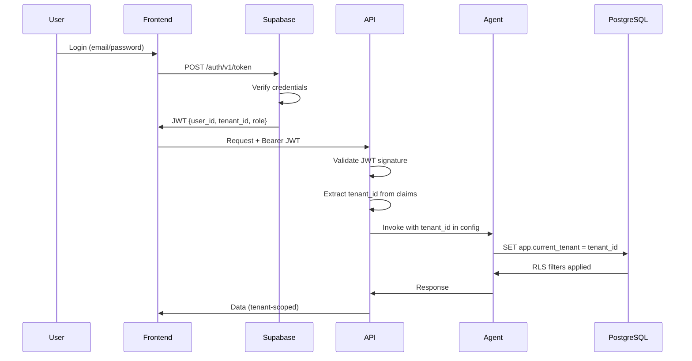

# Security Architecture & Compliance

> **Comprehensive security framework for enterprise-grade multi-tenant AI platform**

**Last Updated:** December 26, 2024
**Version:** 3.0
**Compliance:** GDPR, CCPA, SOC 2 Type II, OWASP Top 10

---

## Table of Contents

- [Security Overview](#security-overview)
- [Authentication & Identity](#authentication--identity)
- [Authorization & Access Control](#authorization--access-control)
- [Data Protection & Privacy](#data-protection--privacy)
- [Multi-Tenant Security](#multi-tenant-security)
- [API Security](#api-security)
- [Infrastructure Security](#infrastructure-security)
- [Compliance & Regulatory](#compliance--regulatory)
- [Incident Response](#incident-response)
- [Security Testing](#security-testing)
- [Secrets Management](#secrets-management)
- [Audit Logging](#audit-logging)

---

## Security Overview

### Security Principles

```yaml
Defense in Depth:
  - Multiple layers of security controls
  - No single point of failure
  - Fail-secure by default

Least Privilege:
  - Minimum permissions required
  - Time-bound access grants
  - Regular permission audits

Zero Trust Architecture:
  - Never trust, always verify
  - Verify explicitly
  - Use least privilege access
  - Assume breach mentality
```

### Threat Model

**Assets:**
- Customer review data (PII, sentiment, location)
- E-commerce transactions (purchase history, payment metadata)
- Loyalty program data (points, rewards, referrals)
- Marketing data (email addresses, consent preferences)
- API keys and integration credentials
- LLM inference data and model weights

**Threat Actors:**
- External attackers (data theft, ransomware)
- Malicious insiders (data exfiltration)
- Compromised credentials (phishing, credential stuffing)
- Supply chain attacks (dependency vulnerabilities)

**Attack Vectors:**
- SQL injection / NoSQL injection
- Cross-site scripting (XSS)
- Authentication bypass
- Privilege escalation
- Data exposure via misconfigured APIs
- Prompt injection (LLM-specific)

---

## Authentication & Identity

### Identity Provider: Supabase Auth

**Architecture:**
```yaml
Provider: Supabase Auth
Protocols: OAuth 2.0, OIDC
Token Format: JWT (RS256 signed)
Token Expiry:
  - Access Token: 1 hour
  - Refresh Token: 30 days (rotating)
Session Management: Secure, HttpOnly cookies
```

### Authentication Flow



### JWT Token Structure

```json
{
  "header": {
    "alg": "RS256",
    "typ": "JWT",
    "kid": "supabase-key-id"
  },
  "payload": {
    "sub": "550e8400-e29b-41d4-a716-446655440000",
    "aud": "authenticated",
    "role": "admin",
    "tenant_id": "tenant-uuid-here",
    "email": "user@example.com",
    "iat": 1703600000,
    "exp": 1703603600
  },
  "signature": "..."
}
```

### Authentication Implementation

```python
# app/core/auth.py
from fastapi import Depends, HTTPException, Security
from fastapi.security import HTTPBearer, HTTPAuthorizationCredentials
from jose import jwt, JWTError
import httpx

security = HTTPBearer()

async def get_current_user(
    credentials: HTTPAuthorizationCredentials = Security(security)
) -> dict:
    """Validate JWT and extract user claims."""
    token = credentials.credentials

    try:
        # Fetch Supabase public key (cached)
        jwks = await get_supabase_jwks()

        # Validate JWT signature
        payload = jwt.decode(
            token,
            jwks,
            algorithms=["RS256"],
            audience="authenticated"
        )

        # Verify required claims
        if "tenant_id" not in payload:
            raise HTTPException(401, "Missing tenant_id in token")

        if "role" not in payload:
            raise HTTPException(401, "Missing role in token")

        # Check token expiration
        if payload["exp"] < time.time():
            raise HTTPException(401, "Token expired")

        return payload

    except JWTError as e:
        raise HTTPException(401, f"Invalid token: {str(e)}")

async def get_supabase_jwks():
    """Fetch Supabase JSON Web Key Set (cached for 24h)."""
    cache_key = "supabase:jwks"
    cached = await redis.get(cache_key)

    if cached:
        return json.loads(cached)

    async with httpx.AsyncClient() as client:
        response = await client.get(
            f"{SUPABASE_URL}/auth/v1/.well-known/jwks.json"
        )
        jwks = response.json()

    await redis.setex(cache_key, 86400, json.dumps(jwks))  # 24h cache
    return jwks
```

### Multi-Factor Authentication (MFA)

```yaml
Supported Methods:
  - TOTP (Time-based One-Time Password)
  - SMS (via Twilio)
  - Email verification codes
  - Biometric (mobile apps only)

Enforcement:
  - Optional for regular users
  - Required for admin/owner roles
  - Required for sensitive operations (e.g., API key generation)

Implementation:
  - Supabase Auth MFA module
  - Backup recovery codes (10 single-use codes)
```

### Password Policy

```yaml
Requirements:
  - Minimum 12 characters
  - Must contain: uppercase, lowercase, number, special char
  - Cannot reuse last 5 passwords
  - Bcrypt hashing (cost factor 12)
  - Password expiry: 90 days (for admin roles)

Breach Detection:
  - Check against HaveIBeenPwned API
  - Reject compromised passwords
```

### Session Management

```python
# app/core/sessions.py
from datetime import datetime, timedelta

class SessionManager:
    """Secure session management with Redis."""

    async def create_session(self, user_id: str, tenant_id: str) -> str:
        """Create secure session with absolute timeout."""
        session_id = secrets.token_urlsafe(32)
        session_data = {
            "user_id": user_id,
            "tenant_id": tenant_id,
            "created_at": datetime.utcnow().isoformat(),
            "last_activity": datetime.utcnow().isoformat(),
            "ip_address": request.client.host,
            "user_agent": request.headers.get("User-Agent")
        }

        # Store in Redis with absolute timeout (8 hours)
        await redis.setex(
            f"session:{session_id}",
            28800,  # 8 hours
            json.dumps(session_data)
        )

        return session_id

    async def validate_session(self, session_id: str) -> dict:
        """Validate session and check for anomalies."""
        session_data = await redis.get(f"session:{session_id}")

        if not session_data:
            raise HTTPException(401, "Session expired or invalid")

        session = json.loads(session_data)

        # Check idle timeout (30 minutes)
        last_activity = datetime.fromisoformat(session["last_activity"])
        if datetime.utcnow() - last_activity > timedelta(minutes=30):
            await self.destroy_session(session_id)
            raise HTTPException(401, "Session idle timeout")

        # Detect IP address change (potential session hijacking)
        if session["ip_address"] != request.client.host:
            await self.destroy_session(session_id)
            await self.alert_security_team(
                "Session hijacking detected",
                user_id=session["user_id"]
            )
            raise HTTPException(401, "Session security violation")

        # Update last activity
        session["last_activity"] = datetime.utcnow().isoformat()
        await redis.setex(
            f"session:{session_id}",
            28800,
            json.dumps(session)
        )

        return session
```

---

## Authorization & Access Control

### Role-Based Access Control (RBAC)

**Role Hierarchy:**
```yaml
owner:
  description: Full system access (tenant-scoped)
  permissions: ["*"]

admin:
  description: Administrative access to all modules
  permissions:
    - view_all_modules
    - manage_reviews
    - manage_products
    - manage_inventory
    - create_campaigns
    - award_points
    - view_analytics
    - manage_users
    - configure_integrations

manager:
  description: Operational management
  permissions:
    - view_all_modules
    - manage_reviews
    - create_campaigns
    - view_analytics
    - respond_to_reviews

analyst:
  description: Read-only analytics access
  permissions:
    - view_all_modules
    - view_analytics
    - export_reports

reviewer:
  description: Review management only
  permissions:
    - view_reviews
    - respond_to_reviews
    - flag_reviews
```

### Permission Enforcement Middleware

```python
# app/core/permissions.py
from functools import wraps
from fastapi import HTTPException

PERMISSION_MATRIX = {
    "owner": ["*"],
    "admin": [
        "view_all_modules", "manage_reviews", "manage_products",
        "manage_inventory", "create_campaigns", "award_points",
        "view_analytics", "manage_users", "configure_integrations"
    ],
    "manager": [
        "view_all_modules", "manage_reviews", "create_campaigns",
        "view_analytics", "respond_to_reviews"
    ],
    "analyst": ["view_all_modules", "view_analytics", "export_reports"],
    "reviewer": ["view_reviews", "respond_to_reviews", "flag_reviews"]
}

def require_permission(permission: str):
    """Decorator to enforce permission checks."""
    def decorator(func):
        @wraps(func)
        async def wrapper(*args, user: dict = Depends(get_current_user), **kwargs):
            user_role = user.get("role", "")

            # Owner has all permissions
            if user_role == "owner":
                return await func(*args, user=user, **kwargs)

            # Check if role has required permission
            allowed_permissions = PERMISSION_MATRIX.get(user_role, [])
            if permission not in allowed_permissions:
                raise HTTPException(
                    403,
                    f"Permission denied: '{permission}' required"
                )

            return await func(*args, user=user, **kwargs)

        return wrapper
    return decorator

# Usage in API endpoints
@app.post("/api/products")
@require_permission("manage_products")
async def create_product(
    product: ProductCreate,
    user: dict = Depends(get_current_user)
):
    # Only users with "manage_products" permission can access
    ...
```

### Attribute-Based Access Control (ABAC)

For advanced scenarios (e.g., "users can only edit their own reviews"):

```python
# app/core/abac.py
from typing import Callable

class ABACPolicy:
    """Attribute-Based Access Control policies."""

    @staticmethod
    def can_edit_review(user: dict, review: dict) -> bool:
        """Users can only edit their own reviews, unless admin."""
        if user["role"] in ["admin", "owner"]:
            return True

        return review["created_by_user_id"] == user["sub"]

    @staticmethod
    def can_view_campaign_analytics(user: dict, campaign: dict) -> bool:
        """Analysts can view all, managers only their own campaigns."""
        if user["role"] in ["admin", "owner", "analyst"]:
            return True

        if user["role"] == "manager":
            return campaign["created_by_user_id"] == user["sub"]

        return False

def enforce_abac(policy: Callable[[dict, dict], bool]):
    """Decorator to enforce ABAC policies."""
    def decorator(func):
        @wraps(func)
        async def wrapper(
            resource_id: str,
            user: dict = Depends(get_current_user),
            *args,
            **kwargs
        ):
            # Fetch resource
            resource = await get_resource(resource_id)

            # Check policy
            if not policy(user, resource):
                raise HTTPException(
                    403,
                    "Access denied by attribute policy"
                )

            return await func(resource_id, user, *args, **kwargs)

        return wrapper
    return decorator

# Usage
@app.put("/api/reviews/{review_id}")
@enforce_abac(ABACPolicy.can_edit_review)
async def update_review(review_id: str, update: ReviewUpdate):
    ...
```

---

## Data Protection & Privacy

### Data Classification

```yaml
Public Data:
  - Product catalog (non-sensitive)
  - Published reviews (public-facing)
  - Aggregated analytics (anonymized)
  Encryption: TLS in transit
  Storage: No special requirements

Confidential Data:
  - Customer emails
  - Review text (before publication)
  - Campaign performance data
  Encryption: TLS in transit, AES-256 at rest
  Storage: Encrypted columns, access logging

Restricted Data:
  - API keys, OAuth tokens
  - Payment metadata (if handling payments)
  - PII (names, phone numbers, addresses)
  Encryption: TLS in transit, AES-256 at rest + field-level encryption
  Storage: Separate encrypted database, HSM for keys
  Access: Strictly controlled, audit logged
```

### Encryption at Rest

**PostgreSQL Transparent Data Encryption (TDE):**
```sql
-- Enable TDE at database level (PostgreSQL 16+)
ALTER DATABASE reviewengine SET encryption = 'AES256';

-- Encrypt specific sensitive columns
CREATE TABLE customers (
    id UUID PRIMARY KEY,
    tenant_id UUID NOT NULL,
    email VARCHAR(255),
    phone_encrypted BYTEA,  -- Field-level encryption
    created_at TIMESTAMPTZ DEFAULT NOW()
);

-- Encrypt phone numbers before storage
CREATE OR REPLACE FUNCTION encrypt_phone(phone TEXT) RETURNS BYTEA AS $$
BEGIN
    RETURN pgp_sym_encrypt(phone, current_setting('app.encryption_key'));
END;
$$ LANGUAGE plpgsql SECURITY DEFINER;

-- Decrypt on retrieval
CREATE OR REPLACE FUNCTION decrypt_phone(encrypted BYTEA) RETURNS TEXT AS $$
BEGIN
    RETURN pgp_sym_decrypt(encrypted, current_setting('app.encryption_key'));
END;
$$ LANGUAGE plpgsql SECURITY DEFINER;
```

**Application-Level Encryption:**
```python
# app/core/encryption.py
from cryptography.fernet import Fernet
import base64

class FieldEncryption:
    """Field-level encryption for sensitive data."""

    def __init__(self, key: bytes):
        self.cipher = Fernet(key)

    def encrypt(self, plaintext: str) -> str:
        """Encrypt string to base64."""
        encrypted_bytes = self.cipher.encrypt(plaintext.encode('utf-8'))
        return base64.b64encode(encrypted_bytes).decode('utf-8')

    def decrypt(self, ciphertext: str) -> str:
        """Decrypt base64 string."""
        encrypted_bytes = base64.b64decode(ciphertext.encode('utf-8'))
        plaintext_bytes = self.cipher.decrypt(encrypted_bytes)
        return plaintext_bytes.decode('utf-8')

# Usage
encryptor = FieldEncryption(key=ENCRYPTION_KEY)

async def store_customer(email: str, phone: str):
    encrypted_phone = encryptor.encrypt(phone)
    await db.execute(
        "INSERT INTO customers (email, phone_encrypted) VALUES ($1, $2)",
        email, encrypted_phone
    )
```

### Encryption in Transit

```yaml
TLS Configuration:
  Version: TLS 1.3 only
  Cipher Suites:
    - TLS_AES_256_GCM_SHA384
    - TLS_CHACHA20_POLY1305_SHA256
    - TLS_AES_128_GCM_SHA256
  Certificate: Let's Encrypt (auto-renewed)
  HSTS: Enabled (max-age=31536000; includeSubDomains; preload)
  Certificate Pinning: Enabled for mobile apps

Internal Communications:
  - mTLS between microservices
  - Encrypted Redis connections (TLS)
  - Encrypted PostgreSQL connections (SSL mode=require)
```

### Data Retention & Deletion

```yaml
Retention Policies:
  Review Data:
    Active: 7 years
    Archived: Indefinite (anonymized)

  Customer PII:
    Active: Duration of account + 30 days
    Deleted: On account deletion or GDPR request

  Audit Logs:
    Security Events: 2 years
    General Logs: 90 days

  LLM Training Data:
    Anonymized Prompts: 1 year
    Raw Conversations: 30 days (then anonymized)

Deletion Methods:
  - Hard Delete: Immediate permanent deletion
  - Soft Delete: Mark deleted, purge after 30 days
  - Anonymization: Replace PII with hashed tokens
```

**GDPR Right to Erasure Implementation:**
```python
# app/api/gdpr.py
from fastapi import APIRouter, Depends

router = APIRouter(prefix="/api/gdpr")

@router.delete("/customers/{customer_id}/erase")
@require_permission("manage_users")
async def gdpr_erase_customer(
    customer_id: str,
    user: dict = Depends(get_current_user)
):
    """GDPR Article 17: Right to Erasure."""

    async with db.transaction():
        # 1. Anonymize reviews (retain for analytics)
        await db.execute("""
            UPDATE reviews
            SET customer_email = 'deleted@gdpr.local',
                customer_name = 'Deleted User',
                ip_address = NULL,
                anonymized = TRUE,
                anonymized_at = NOW()
            WHERE customer_id = $1
        """, customer_id)

        # 2. Delete customer PII
        await db.execute("""
            DELETE FROM customers
            WHERE id = $1
        """, customer_id)

        # 3. Delete loyalty program data
        await yotpo_client.delete_customer(customer_id)

        # 4. Unsubscribe from marketing
        await klaviyo_client.delete_profile(customer_id)

        # 5. Delete mobile app data
        await db.execute("""
            DELETE FROM mobile_sessions
            WHERE customer_id = $1
        """, customer_id)

        # 6. Create audit log entry
        await audit_log.log_event(
            event_type="gdpr_erasure",
            user_id=user["sub"],
            resource_id=customer_id,
            details={"requested_by": user["email"]}
        )

    return {"status": "Customer data erased", "customer_id": customer_id}

@router.get("/customers/{customer_id}/export")
@require_permission("manage_users")
async def gdpr_export_customer(customer_id: str):
    """GDPR Article 20: Right to Data Portability."""

    # Fetch all customer data
    customer = await db.fetch_one(
        "SELECT * FROM customers WHERE id = $1", customer_id
    )

    reviews = await db.fetch_all(
        "SELECT * FROM reviews WHERE customer_id = $1", customer_id
    )

    loyalty_data = await yotpo_client.get_customer_data(customer_id)
    marketing_data = await klaviyo_client.get_profile(customer_id)

    # Compile into standardized JSON format
    export_data = {
        "customer": customer,
        "reviews": reviews,
        "loyalty": loyalty_data,
        "marketing": marketing_data,
        "export_date": datetime.utcnow().isoformat(),
        "format": "JSON (machine-readable)"
    }

    return export_data
```

### Data Anonymization

```python
# app/core/anonymization.py
import hashlib

class DataAnonymizer:
    """Anonymize PII while preserving analytics utility."""

    @staticmethod
    def anonymize_email(email: str) -> str:
        """Convert email to irreversible hash."""
        return hashlib.sha256(email.encode()).hexdigest()[:16]

    @staticmethod
    def anonymize_ip(ip: str) -> str:
        """Mask last octet of IPv4 address."""
        parts = ip.split('.')
        if len(parts) == 4:
            return f"{parts[0]}.{parts[1]}.{parts[2]}.0"
        return "0.0.0.0"

    @staticmethod
    def anonymize_text(text: str) -> str:
        """Remove PII from review text using NER."""
        # Use spaCy NER to detect and redact PII
        import spacy
        nlp = spacy.load("en_core_web_sm")
        doc = nlp(text)

        anonymized = text
        for ent in reversed(doc.ents):  # Reverse to maintain offsets
            if ent.label_ in ["PERSON", "EMAIL", "PHONE", "GPE"]:
                anonymized = (
                    anonymized[:ent.start_char] +
                    f"[{ent.label_}]" +
                    anonymized[ent.end_char:]
                )

        return anonymized
```

---

## Multi-Tenant Security

### Row-Level Security (RLS)

**PostgreSQL RLS Implementation:**
```sql
-- Enable RLS on all tenant-scoped tables
ALTER TABLE reviews ENABLE ROW LEVEL SECURITY;
ALTER TABLE customers ENABLE ROW LEVEL SECURITY;
ALTER TABLE products ENABLE ROW LEVEL SECURITY;
ALTER TABLE loyalty_points ENABLE ROW LEVEL SECURITY;

-- Policy: Users can only access their tenant's data
CREATE POLICY tenant_isolation_policy ON reviews
    FOR ALL
    TO authenticated
    USING (tenant_id = current_setting('app.current_tenant')::uuid);

CREATE POLICY tenant_isolation_policy ON customers
    FOR ALL
    TO authenticated
    USING (tenant_id = current_setting('app.current_tenant')::uuid);

-- Admin bypass policy (for system operations)
CREATE POLICY admin_bypass_policy ON reviews
    FOR ALL
    TO service_role
    USING (true);

-- Prevent cross-tenant data leakage via foreign keys
ALTER TABLE reviews
    ADD CONSTRAINT fk_reviews_tenant
    FOREIGN KEY (tenant_id) REFERENCES tenants(id)
    ON DELETE CASCADE;
```

**Application-Level RLS Enforcement:**
```python
# app/core/db.py
from contextlib import asynccontextmanager

@asynccontextmanager
async def get_tenant_db_session(tenant_id: str):
    """Create database session with tenant context."""
    async with db_pool.acquire() as conn:
        # Set tenant context for RLS
        await conn.execute(
            f"SET LOCAL app.current_tenant = '{tenant_id}'"
        )

        # Set role to 'authenticated' (not service_role)
        await conn.execute("SET ROLE authenticated")

        try:
            yield conn
        finally:
            # Reset to service role
            await conn.execute("RESET ROLE")
            await conn.execute("RESET app.current_tenant")

# Usage in agents
async def process_review(state: ReviewState, config: dict):
    tenant_id = config["configurable"]["tenant_id"]

    async with get_tenant_db_session(tenant_id) as db:
        # All queries automatically filtered by tenant_id via RLS
        review = await db.fetch_one(
            "SELECT * FROM reviews WHERE id = $1",
            state.review_id
        )
        # RLS ensures only this tenant's data is accessible
```

### Tenant Isolation Verification

```python
# tests/security/test_tenant_isolation.py
import pytest

async def test_cross_tenant_data_access_blocked():
    """Verify tenants cannot access other tenants' data."""
    # Create two tenants
    tenant_a = await create_tenant("Tenant A")
    tenant_b = await create_tenant("Tenant B")

    # Create review for Tenant A
    review_a = await create_review(tenant_id=tenant_a.id, text="Test review A")

    # Attempt to access Tenant A's review from Tenant B's context
    async with get_tenant_db_session(tenant_b.id) as db:
        result = await db.fetch_one(
            "SELECT * FROM reviews WHERE id = $1",
            review_a.id
        )

        # Should return None due to RLS filtering
        assert result is None, "Cross-tenant data leak detected!"

async def test_admin_can_access_all_tenants():
    """Verify service role can access all tenant data."""
    tenant_a = await create_tenant("Tenant A")
    tenant_b = await create_tenant("Tenant B")

    review_a = await create_review(tenant_id=tenant_a.id, text="Review A")
    review_b = await create_review(tenant_id=tenant_b.id, text="Review B")

    # Use service role (bypass RLS)
    async with db_pool.acquire() as db:
        await db.execute("SET ROLE service_role")

        all_reviews = await db.fetch_all("SELECT * FROM reviews")

        # Should see both tenants' reviews
        assert len(all_reviews) >= 2
        tenant_ids = {r["tenant_id"] for r in all_reviews}
        assert tenant_a.id in tenant_ids
        assert tenant_b.id in tenant_ids
```

### Tenant Resource Quotas

```python
# app/core/quotas.py
from dataclasses dataclass

@dataclass
class TenantQuota:
    max_reviews_per_month: int
    max_api_calls_per_day: int
    max_storage_gb: int
    max_users: int

QUOTA_TIERS = {
    "starter": TenantQuota(
        max_reviews_per_month=1000,
        max_api_calls_per_day=10000,
        max_storage_gb=5,
        max_users=5
    ),
    "professional": TenantQuota(
        max_reviews_per_month=10000,
        max_api_calls_per_day=100000,
        max_storage_gb=50,
        max_users=25
    ),
    "enterprise": TenantQuota(
        max_reviews_per_month=100000,
        max_api_calls_per_day=1000000,
        max_storage_gb=500,
        max_users=100
    )
}

async def check_quota(tenant_id: str, resource_type: str):
    """Enforce resource quotas per tenant."""
    tenant = await db.fetch_one(
        "SELECT tier FROM tenants WHERE id = $1", tenant_id
    )
    quota = QUOTA_TIERS[tenant["tier"]]

    if resource_type == "reviews":
        current_count = await db.fetch_val(
            """
            SELECT COUNT(*) FROM reviews
            WHERE tenant_id = $1
              AND created_at >= date_trunc('month', NOW())
            """,
            tenant_id
        )

        if current_count >= quota.max_reviews_per_month:
            raise HTTPException(
                429,
                f"Monthly review quota exceeded ({quota.max_reviews_per_month})"
            )
```

---

## API Security

### Rate Limiting

```python
# app/middleware/rate_limit.py
from slowapi import Limiter, _rate_limit_exceeded_handler
from slowapi.util import get_remote_address

limiter = Limiter(key_func=get_remote_address)

# Global rate limits
app.state.limiter = limiter
app.add_exception_handler(RateLimitExceeded, _rate_limit_exceeded_handler)

# Endpoint-specific rate limits
@app.post("/api/reviews")
@limiter.limit("100/minute")  # Per IP
async def create_review(request: Request):
    ...

@app.post("/api/auth/login")
@limiter.limit("5/minute")  # Stricter for auth
async def login(request: Request):
    ...

# Tenant-specific rate limits (using Redis)
async def check_tenant_rate_limit(tenant_id: str, limit: int, window: int):
    """Enforce rate limits per tenant."""
    key = f"rate_limit:tenant:{tenant_id}:{int(time.time() // window)}"

    current = await redis.incr(key)
    await redis.expire(key, window)

    if current > limit:
        raise HTTPException(
            429,
            f"Tenant rate limit exceeded: {limit} requests per {window}s"
        )
```

### API Key Management

```python
# app/api/api_keys.py
import secrets

async def create_api_key(
    tenant_id: str,
    name: str,
    permissions: list[str],
    expires_at: Optional[datetime] = None
) -> dict:
    """Create tenant-scoped API key."""
    # Generate cryptographically secure key
    api_key = f"rve_{secrets.token_urlsafe(32)}"
    key_hash = hashlib.sha256(api_key.encode()).hexdigest()

    # Store hash (never store plaintext)
    await db.execute("""
        INSERT INTO api_keys (
            tenant_id, name, key_hash, permissions, expires_at
        ) VALUES ($1, $2, $3, $4, $5)
    """, tenant_id, name, key_hash, permissions, expires_at)

    # Return plaintext key ONCE (user must save it)
    return {
        "api_key": api_key,  # Show once
        "name": name,
        "permissions": permissions,
        "warning": "Save this key. It will not be shown again."
    }

async def validate_api_key(api_key: str) -> dict:
    """Validate API key and return associated tenant."""
    key_hash = hashlib.sha256(api_key.encode()).hexdigest()

    key_data = await db.fetch_one("""
        SELECT tenant_id, permissions, expires_at, last_used_at
        FROM api_keys
        WHERE key_hash = $1
          AND (expires_at IS NULL OR expires_at > NOW())
          AND revoked_at IS NULL
    """, key_hash)

    if not key_data:
        raise HTTPException(401, "Invalid or expired API key")

    # Update last used timestamp (async, non-blocking)
    asyncio.create_task(
        db.execute(
            "UPDATE api_keys SET last_used_at = NOW() WHERE key_hash = $1",
            key_hash
        )
    )

    return key_data
```

### Input Validation & Sanitization

```python
# app/schemas/reviews.py
from pydantic import BaseModel, Field, validator
import bleach

class ReviewCreate(BaseModel):
    """Validated review input schema."""

    source: Literal["google", "yelp", "facebook", "synup"]
    rating: int = Field(ge=1, le=5)
    text: str = Field(min_length=1, max_length=10000)
    customer_email: EmailStr
    location: Optional[dict] = None

    @validator("text")
    def sanitize_text(cls, v):
        """Remove HTML tags and dangerous characters."""
        # Strip HTML tags
        clean_text = bleach.clean(v, tags=[], strip=True)

        # Remove null bytes
        clean_text = clean_text.replace('\x00', '')

        # Limit newlines
        lines = clean_text.split('\n')
        if len(lines) > 100:
            raise ValueError("Too many newlines in review text")

        return clean_text

    @validator("customer_email")
    def check_email_disposable(cls, v):
        """Reject disposable email addresses."""
        disposable_domains = ["tempmail.com", "10minutemail.com"]
        domain = v.split('@')[1].lower()

        if domain in disposable_domains:
            raise ValueError("Disposable email addresses not allowed")

        return v

# SQL Injection Prevention (parameterized queries)
# NEVER do this:
# query = f"SELECT * FROM reviews WHERE id = '{review_id}'"  # VULNERABLE!

# ALWAYS do this:
query = "SELECT * FROM reviews WHERE id = $1"  # SAFE (parameterized)
result = await db.fetch_one(query, review_id)
```

### CORS Configuration

```python
# app/main.py
from fastapi.middleware.cors import CORSMiddleware

app.add_middleware(
    CORSMiddleware,
    allow_origins=[
        "https://app.reviewengine.com",
        "https://*.reviewengine.com",  # Wildcard subdomains
        "http://localhost:3000"  # Dev only
    ],
    allow_credentials=True,
    allow_methods=["GET", "POST", "PUT", "PATCH", "DELETE"],
    allow_headers=["Authorization", "Content-Type"],
    max_age=3600  # Cache preflight for 1 hour
)
```

---

## Infrastructure Security

### Container Security

```yaml
Docker Image Hardening:
  Base Image: python:3.11-slim (minimal attack surface)
  No Root: Run as non-root user (UID 1000)
  Read-Only Filesystem: Mount volumes read-only where possible
  Security Scanning: Trivy scan on every build

  # Dockerfile example
  FROM python:3.11-slim

  # Create non-root user
  RUN useradd -m -u 1000 appuser

  WORKDIR /app

  # Install dependencies as root
  COPY requirements.txt .
  RUN pip install --no-cache-dir -r requirements.txt

  # Copy application code
  COPY --chown=appuser:appuser . .

  # Switch to non-root user
  USER appuser

  # Run application
  CMD ["uvicorn", "app.main:app", "--host", "0.0.0.0", "--port", "8000"]
```

### Kubernetes Security

```yaml
# kubernetes/security-policies.yaml
apiVersion: v1
kind: SecurityContext
spec:
  runAsNonRoot: true
  runAsUser: 1000
  readOnlyRootFilesystem: true
  allowPrivilegeEscalation: false
  capabilities:
    drop:
      - ALL

---
apiVersion: networking.k8s.io/v1
kind: NetworkPolicy
metadata:
  name: review-engine-network-policy
spec:
  podSelector:
    matchLabels:
      app: review-engine
  policyTypes:
    - Ingress
    - Egress
  ingress:
    - from:
        - podSelector:
            matchLabels:
              app: ingress-nginx
      ports:
        - protocol: TCP
          port: 8000
  egress:
    - to:
        - podSelector:
            matchLabels:
              app: postgresql
      ports:
        - protocol: TCP
          port: 5432
    - to:
        - podSelector:
            matchLabels:
              app: redis
      ports:
        - protocol: TCP
          port: 6379
```

### Secrets Management

```yaml
Infrastructure:
  Development: .env files (never committed)
  Staging: AWS Secrets Manager
  Production: AWS Secrets Manager + HashiCorp Vault

Rotation Schedule:
  Database Passwords: Every 90 days
  API Keys (External): Every 180 days
  Encryption Keys: Every 365 days
  JWT Signing Keys: Every 180 days

Access Control:
  - Secrets encrypted at rest (AWS KMS)
  - Access logged and monitored
  - Principle of least privilege
  - Automatic expiry for temporary credentials
```

```python
# app/core/secrets.py
import boto3
from functools import lru_cache

class SecretsManager:
    """Centralized secrets management."""

    def __init__(self):
        self.client = boto3.client('secretsmanager', region_name='us-east-1')
        self.cache_ttl = 300  # 5 minutes

    @lru_cache(maxsize=128)
    def get_secret(self, secret_name: str) -> dict:
        """Fetch secret from AWS Secrets Manager (cached)."""
        response = self.client.get_secret_value(SecretId=secret_name)
        return json.loads(response['SecretString'])

    async def rotate_secret(self, secret_name: str):
        """Rotate secret and update all references."""
        # Generate new secret value
        new_value = secrets.token_urlsafe(32)

        # Update in Secrets Manager
        self.client.update_secret(
            SecretId=secret_name,
            SecretString=json.dumps({"value": new_value})
        )

        # Invalidate cache
        self.get_secret.cache_clear()

        # Update all services using this secret
        await self.update_service_config(secret_name, new_value)
```

---

## Compliance & Regulatory

### GDPR Compliance

```yaml
Principles:
  1. Lawfulness, Fairness, Transparency:
     - Privacy policy clearly explains data usage
     - Consent explicitly obtained before data collection

  2. Purpose Limitation:
     - Data only used for stated purposes
     - No secondary use without consent

  3. Data Minimization:
     - Only collect necessary data
     - Delete unnecessary data after 30 days

  4. Accuracy:
     - Users can update their information
     - Incorrect data corrected within 48 hours

  5. Storage Limitation:
     - Retention policies enforced (see Data Retention)
     - Automated deletion after retention period

  6. Integrity & Confidentiality:
     - Encryption at rest and in transit
     - Access controls and audit logging

  7. Accountability:
     - DPO (Data Protection Officer) appointed
     - Regular privacy impact assessments
     - Data breach notification within 72 hours

Implementation:
  - Consent Management UI (marketing module)
  - Right to Access API (GET /api/gdpr/export)
  - Right to Erasure API (DELETE /api/gdpr/erase)
  - Right to Portability (JSON export)
  - Right to Object (opt-out mechanisms)
```

### SOC 2 Type II Compliance

```yaml
Trust Service Criteria:

Security (CC6):
  - Logical and physical access controls
  - System operations monitoring
  - Change management procedures
  - Risk mitigation processes

Availability (A1):
  - 99.9% uptime SLA
  - Disaster recovery plan (RTO: 4 hours, RPO: 1 hour)
  - Redundant infrastructure (multi-AZ)

Processing Integrity (PI1):
  - Data validation at input
  - Error handling and logging
  - Monitoring and alerting

Confidentiality (C1):
  - Data classification policies
  - Encryption requirements
  - NDA with vendors

Privacy (P1):
  - Privacy notice and consent
  - Data retention and disposal
  - GDPR compliance (see above)

Controls Implemented:
  - Quarterly access reviews
  - Penetration testing (annual)
  - Vulnerability scanning (weekly)
  - Security awareness training (quarterly)
  - Incident response plan
```

### CCPA Compliance

```yaml
Consumer Rights:
  1. Right to Know:
     - API endpoint: GET /api/ccpa/categories
     - Response time: 45 days

  2. Right to Delete:
     - API endpoint: DELETE /api/ccpa/delete
     - Response time: 45 days

  3. Right to Opt-Out:
     - "Do Not Sell My Personal Information" link
     - Honors Global Privacy Control (GPC) signals

  4. Right to Non-Discrimination:
     - No service degradation for privacy requests
     - No price differences

Implementation:
  - Privacy Policy with CCPA-specific language
  - Cookie consent banner with opt-out option
  - Vendor agreements (data sharing disclosures)
```

---

## Incident Response

### Incident Response Plan

```yaml
Phases:
  1. Preparation:
     - Incident response team identified
     - Runbooks for common scenarios
     - Communication templates ready

  2. Detection & Analysis:
     - Automated alerts (SIEM)
     - Log aggregation and analysis
     - Threat intelligence feeds

  3. Containment:
     - Isolate affected systems
     - Preserve evidence (logs, snapshots)
     - Block malicious IPs/users

  4. Eradication:
     - Remove malware, backdoors
     - Patch vulnerabilities
     - Reset compromised credentials

  5. Recovery:
     - Restore from clean backups
     - Gradual service restoration
     - Monitoring for re-infection

  6. Post-Incident:
     - Root cause analysis
     - Update security controls
     - Document lessons learned

Severity Levels:
  Critical (P1):
    - Data breach (PII exposed)
    - Service completely down
    - Active attack in progress
    Response Time: <15 minutes

  High (P2):
    - Potential data exposure
    - Significant service degradation
    - Vulnerability actively exploited
    Response Time: <1 hour

  Medium (P3):
    - Minor service disruption
    - Security control failure
    - Policy violation
    Response Time: <4 hours

  Low (P4):
    - Non-critical vulnerability
    - Informational security finding
    Response Time: <24 hours
```

### Data Breach Response

```python
# app/core/incident_response.py
from datetime import datetime, timedelta

class DataBreachHandler:
    """Handle data breach incidents per GDPR Article 33."""

    async def detect_breach(
        self,
        affected_records: int,
        data_types: list[str],
        breach_vector: str
    ):
        """Detect and classify data breach."""
        # Classify severity
        contains_sensitive_data = any(
            dt in data_types for dt in ["email", "phone", "payment_info"]
        )

        is_major_breach = (
            affected_records > 1000 or
            contains_sensitive_data
        )

        # Create incident record
        incident_id = await self.create_incident_record(
            type="data_breach",
            severity="critical" if is_major_breach else "high",
            affected_records=affected_records,
            data_types=data_types,
            breach_vector=breach_vector
        )

        # Immediate containment
        await self.contain_breach(incident_id)

        # Notify stakeholders
        if is_major_breach:
            await self.notify_authorities(incident_id)  # GDPR: 72 hours
            await self.notify_affected_users(incident_id)

        return incident_id

    async def notify_authorities(self, incident_id: str):
        """Notify supervisory authority (GDPR Article 33)."""
        incident = await self.get_incident(incident_id)

        # Prepare breach notification
        notification = {
            "nature_of_breach": incident["breach_vector"],
            "categories_of_data": incident["data_types"],
            "approximate_number_affected": incident["affected_records"],
            "likely_consequences": await self.assess_consequences(incident),
            "measures_taken": await self.get_mitigation_steps(incident),
            "contact_dpo": "dpo@reviewengine.com"
        }

        # Submit to supervisory authority within 72 hours
        deadline = incident["detected_at"] + timedelta(hours=72)
        if datetime.utcnow() > deadline:
            logger.critical("GDPR breach notification deadline exceeded!")

        await self.submit_to_authority(notification)

    async def notify_affected_users(self, incident_id: str):
        """Notify affected users (GDPR Article 34)."""
        incident = await self.get_incident(incident_id)

        # Fetch affected users
        affected_users = await db.fetch_all("""
            SELECT email, name FROM customers
            WHERE id = ANY($1)
        """, incident["affected_user_ids"])

        for user in affected_users:
            await email_service.send(
                to=user["email"],
                subject="Security Notice: Data Breach Notification",
                template="data_breach_notification",
                context={
                    "name": user["name"],
                    "incident_id": incident_id,
                    "breach_date": incident["detected_at"],
                    "data_types": incident["data_types"],
                    "recommended_actions": [
                        "Change your password immediately",
                        "Monitor your accounts for suspicious activity",
                        "Enable two-factor authentication"
                    ],
                    "contact_email": "security@reviewengine.com"
                }
            )
```

---

## Security Testing

### Continuous Security Scanning

```yaml
Tools & Schedule:

Static Analysis (Daily):
  - Bandit (Python security linter)
  - Semgrep (SAST tool)
  - SonarQube (code quality + security)

Dependency Scanning (Daily):
  - Safety (Python dependencies)
  - npm audit (JavaScript dependencies)
  - Snyk (multi-language)

Container Scanning (On Build):
  - Trivy (container vulnerability scanner)
  - Docker Bench for Security

Dynamic Analysis (Weekly):
  - OWASP ZAP (automated scans)
  - Burp Suite (manual testing)

Penetration Testing (Quarterly):
  - Third-party security firm
  - Comprehensive application + infrastructure testing
  - Compliance with SOC 2 requirements
```

### Security Testing in CI/CD

```yaml
# .github/workflows/security.yml
name: Security Checks

on: [push, pull_request]

jobs:
  security-scan:
    runs-on: ubuntu-latest
    steps:
      - uses: actions/checkout@v3

      - name: Run Bandit (Python Security Linter)
        run: |
          pip install bandit
          bandit -r agents/ app/ -f json -o bandit-report.json

      - name: Check for Secrets
        uses: trufflesecurity/trufflehog@v3
        with:
          path: ./

      - name: Dependency Check
        run: |
          pip install safety
          safety check --json

      - name: Container Scan
        run: |
          docker build -t review-engine:test .
          trivy image review-engine:test --severity HIGH,CRITICAL --exit-code 1

      - name: SAST Scan
        uses: returntocorp/semgrep-action@v1
        with:
          config: >-
            p/security-audit
            p/owasp-top-ten
```

---

## Audit Logging

### Audit Log Requirements

```yaml
Events to Log:
  Authentication:
    - Login attempts (success/failure)
    - Logout events
    - Password changes
    - MFA enrollment/removal

  Authorization:
    - Permission changes
    - Role assignments
    - Access denials

  Data Access:
    - PII accessed (customer details, reviews)
    - Data exports (GDPR, reports)
    - Bulk data operations

  Data Modification:
    - Review creation/updates/deletes
    - Customer data changes
    - System configuration changes

  Security Events:
    - Failed authentication attempts (>5)
    - Suspicious activity detected
    - API key creation/revocation
    - IP blacklisting

Log Retention:
  Security Events: 2 years
  Access Logs: 90 days
  Application Logs: 30 days
```

### Audit Log Implementation

```python
# app/core/audit_log.py
from enum import Enum

class AuditEventType(Enum):
    USER_LOGIN = "user_login"
    USER_LOGOUT = "user_logout"
    DATA_ACCESS = "data_access"
    DATA_MODIFICATION = "data_modification"
    PERMISSION_CHANGE = "permission_change"
    SECURITY_EVENT = "security_event"
    GDPR_REQUEST = "gdpr_request"

class AuditLogger:
    """Centralized audit logging."""

    async def log_event(
        self,
        event_type: AuditEventType,
        user_id: Optional[str],
        resource_type: str,
        resource_id: Optional[str],
        action: str,
        result: str,  # success, failure, denied
        metadata: dict = None
    ):
        """Log security-relevant event."""
        event = {
            "event_id": str(uuid.uuid4()),
            "timestamp": datetime.utcnow().isoformat(),
            "event_type": event_type.value,
            "user_id": user_id,
            "ip_address": request.client.host if request else None,
            "user_agent": request.headers.get("User-Agent") if request else None,
            "resource_type": resource_type,
            "resource_id": resource_id,
            "action": action,
            "result": result,
            "metadata": metadata or {}
        }

        # Write to audit log table
        await db.execute("""
            INSERT INTO audit_logs (
                event_id, timestamp, event_type, user_id, ip_address,
                user_agent, resource_type, resource_id, action, result, metadata
            ) VALUES ($1, $2, $3, $4, $5, $6, $7, $8, $9, $10, $11)
        """, *event.values())

        # Send to SIEM for real-time alerting
        await self.send_to_siem(event)

    async def send_to_siem(self, event: dict):
        """Forward event to SIEM (e.g., Datadog, Splunk)."""
        # Send to Datadog Logs
        async with httpx.AsyncClient() as client:
            await client.post(
                "https://http-intake.logs.datadoghq.com/api/v2/logs",
                headers={
                    "DD-API-KEY": DATADOG_API_KEY,
                    "Content-Type": "application/json"
                },
                json={
                    "ddsource": "review-engine",
                    "ddtags": "env:production,service:audit",
                    "message": json.dumps(event)
                }
            )

# Usage in endpoints
@app.post("/api/customers/{customer_id}/gdpr-erase")
async def gdpr_erase(
    customer_id: str,
    user: dict = Depends(get_current_user)
):
    try:
        await erase_customer_data(customer_id)

        await audit_log.log_event(
            event_type=AuditEventType.GDPR_REQUEST,
            user_id=user["sub"],
            resource_type="customer",
            resource_id=customer_id,
            action="gdpr_erase",
            result="success",
            metadata={"requested_by_email": user["email"]}
        )

        return {"status": "erased"}

    except Exception as e:
        await audit_log.log_event(
            event_type=AuditEventType.GDPR_REQUEST,
            user_id=user["sub"],
            resource_type="customer",
            resource_id=customer_id,
            action="gdpr_erase",
            result="failure",
            metadata={"error": str(e)}
        )

        raise
```

---

## Security Checklist

### Pre-Deployment Security Review

```yaml
Authentication & Authorization:
  ☐ JWT tokens have expiration (≤1 hour)
  ☐ Refresh tokens rotate on use
  ☐ MFA enabled for admin accounts
  ☐ Password policy enforced (12+ chars, complexity)
  ☐ RBAC permissions tested for all roles
  ☐ API keys rotated regularly (90-day schedule)

Data Protection:
  ☐ TLS 1.3 enforced (no TLS 1.2/1.1)
  ☐ Database encryption at rest (AES-256)
  ☐ Sensitive fields encrypted (phone, payment data)
  ☐ PII anonymization functions tested
  ☐ Data retention policies implemented
  ☐ GDPR deletion APIs functional

Multi-Tenant Security:
  ☐ Row-level security (RLS) enabled on all tables
  ☐ Cross-tenant access tests passed
  ☐ Tenant isolation verified in integration tests
  ☐ Resource quotas enforced per tenant

API Security:
  ☐ Rate limiting configured (100 req/min)
  ☐ Input validation on all endpoints (Pydantic)
  ☐ SQL injection prevention (parameterized queries)
  ☐ XSS prevention (output encoding)
  ☐ CORS configured (whitelist only)
  ☐ API versioning implemented

Infrastructure:
  ☐ Containers run as non-root user
  ☐ Network policies restrict inter-pod traffic
  ☐ Secrets stored in AWS Secrets Manager (not env vars)
  ☐ Vulnerability scanning in CI/CD pipeline
  ☐ Least privilege IAM roles

Compliance:
  ☐ Privacy policy published and accessible
  ☐ Consent management UI functional
  ☐ GDPR export/erase APIs tested
  ☐ Audit logging enabled for all sensitive operations
  ☐ Incident response plan documented

Monitoring:
  ☐ Failed login alerts configured (>5 attempts)
  ☐ Data access anomalies monitored
  ☐ Security event dashboards created
  ☐ On-call rotation defined for security incidents
```

---

## Security Contacts

**Security Team:**
- Security Lead: security-lead@reviewengine.com
- Incident Response: incidents@reviewengine.com
- Data Protection Officer: dpo@reviewengine.com

**Responsible Disclosure:**
- Email: security@reviewengine.com
- Bug Bounty Program: https://reviewengine.com/security/bug-bounty
- PGP Key: https://reviewengine.com/security/pgp-key.asc

**Response Times:**
- Critical vulnerabilities: <24 hours
- High vulnerabilities: <72 hours
- Medium vulnerabilities: <7 days

---

**Last Security Audit:** [To be scheduled]
**Next Penetration Test:** [To be scheduled]
**SOC 2 Certification:** [In progress]

---

**Security is a shared responsibility. Report security concerns immediately.**
